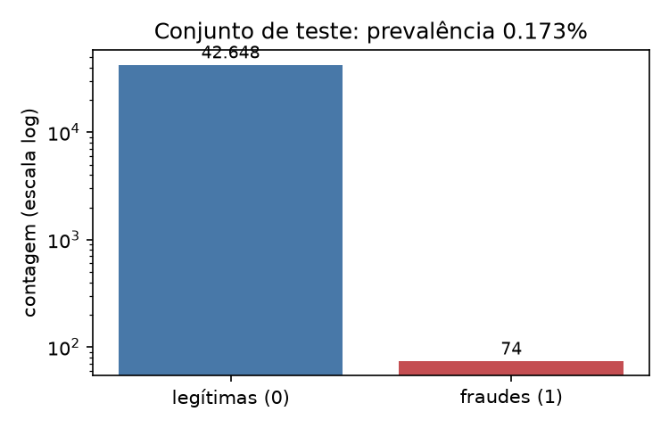
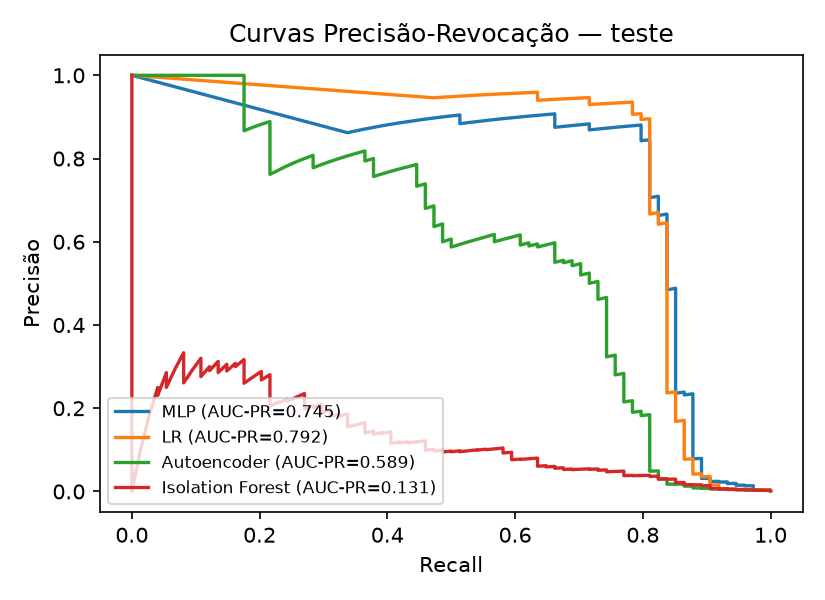
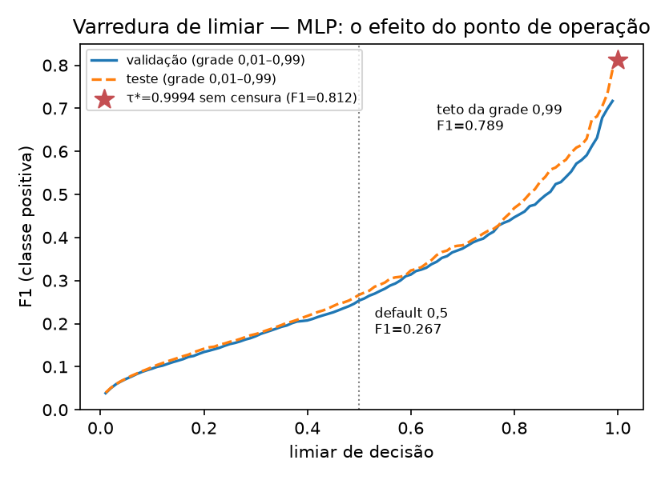
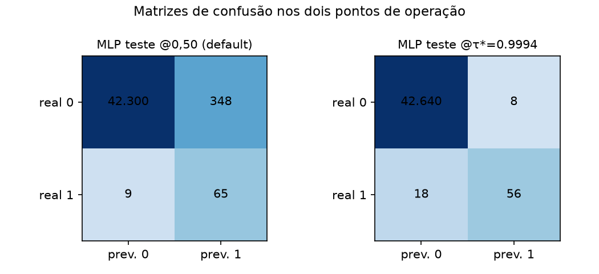
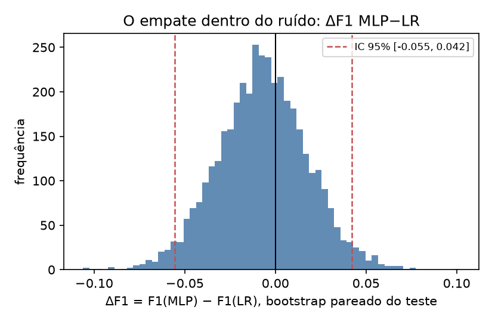
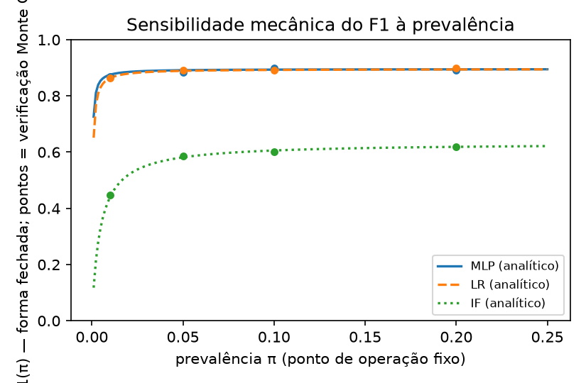
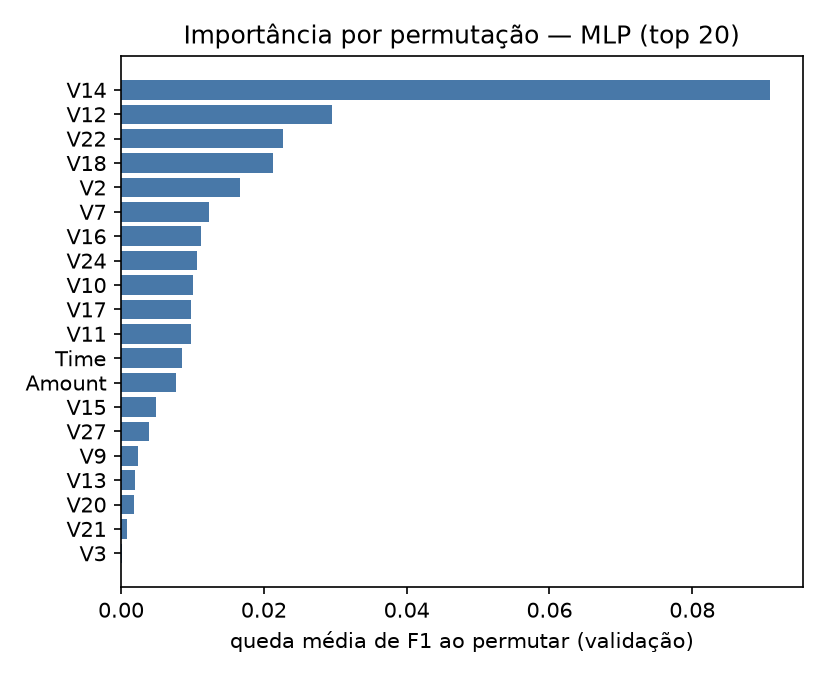

# Ponto de operação, protocolo e a fragilidade do ranking de arquiteturas na detecção de fraude em cartões: um estudo de caso confirmatório e auditável no benchmark ULB/Worldline

**Carlos Ulisses Flores**
Codex Hash Research Laboratory, Codex Hash Ltda., Brazil
ORCID: 0000-0002-6034-7765

2026

## Resumo

Detectar fraude em cartões de crédito é um problema de classe rara: no benchmark público ULB/Worldline, apenas 0,173% das 284.807 transações são fraudulentas, e a literatura da área disputa há anos qual arquitetura de modelo detecta melhor. Este artigo mede uma pergunta anterior e mais prática: quanto do desempenho operacional de um detector vem, de fato, da escolha da arquitetura — e quanto vem de um único escalar, o limiar de decisão (o ponto de operação) selecionado em validação sob reponderação de custo. Quatro famílias de modelos — Perceptron Multi-Camadas (MLP), Regressão Logística (LR), Autoencoder e Isolation Forest — são comparadas sob protocolo auditável e sem vazamento de pré-processamento: padronização ajustada apenas no treino, reponderação de custo em vez de sobreamostragem sintética, dados ancorados por SHA-256 e determinismo verificado por re-execução idêntica. A assimetria encontrada é de duas ordens de magnitude. Deslocar o limiar do MLP do valor-padrão 0,5 para o ótimo selecionado em validação (0,9994) eleva o F1 de teste de 0,267 para 0,812; trocar a arquitetura, no mesmo regime, desloca −0,007, com intervalo bootstrap pareado de 95% [−0,055; +0,042] — indistinguível de zero e menor que o desvio-padrão de treino do próprio MLP re-treinado sob 20 sementes (0,016). Uma aparente vitória do MLP (ΔF1 = +0,053, com intervalo excluindo zero) é demonstrada como artefato de protocolo: a grade de limiares herdada do material precedente, truncada em 0,99, fabricava a diferença. Conclui-se que, neste regime tabular de classe rara pós-análise de componentes principais (PCA), a alavanca dominante de engenharia e de governança é o acoplamento entre reponderação de custo e limiar auditável — não a família do modelo — e que micro-decisões de protocolo, herdadas sem exame, bastam para inverter conclusões de comparações de arquitetura.

**Palavras-chave:** detecção de fraude; classe rara; ponto de operação; aprendizado sensível a custo; vazamento de dados; reprodutibilidade

## Abstract

Credit-card fraud detection is a rare-class problem: in the public ULB/Worldline benchmark, only 0.173% of the 284,807 transactions are fraudulent, and the literature has long disputed which model architecture detects fraud best. This paper measures a prior and more practical question: how much of a detector's operational performance actually comes from architecture choice — and how much comes from a single scalar, the decision threshold (the operating point) selected on validation under cost reweighting. Four model families — Multi-Layer Perceptron (MLP), Logistic Regression (LR), Autoencoder, and Isolation Forest — are compared under an auditable protocol free of preprocessing leakage: standardization fitted on the training split only, cost reweighting instead of synthetic oversampling, SHA-256-anchored data, and determinism verified by identical re-execution. The asymmetry found spans two orders of magnitude. Moving the MLP threshold from the 0.5 default to the validation-selected optimum (0.9994) raises test F1 from 0.267 to 0.812; switching architectures, in the same regime, moves −0.007, with a 95% paired-bootstrap interval of [−0.055; +0.042] — indistinguishable from zero and smaller than the training standard deviation of the MLP itself retrained under 20 seeds (0.016). An apparent MLP win (ΔF1 = +0.053, with an interval excluding zero) is shown to be a protocol artifact: the threshold grid inherited from the precedent material, truncated at 0.99, manufactured the difference. We conclude that, in this rare-class tabular regime post principal component analysis (PCA), the dominant engineering and governance lever is the coupling between cost reweighting and an auditable threshold — not the model family — and that protocol micro-decisions, inherited without scrutiny, suffice to flip the conclusions of architecture comparisons.

**Keywords:** fraud detection; rare class; operating point; cost-sensitive learning; data leakage; reproducibility

## 1. Introdução

A literatura de detecção de fraude em cartões acumula, há duas décadas, ganhos reportados de arquitetura que raramente sobrevivem a escrutínio metodológico — o fenômeno que Hand (2006) denominou ilusão de progresso e que Hayat e Magnier (2025) documentaram especificamente no benchmark ULB/Worldline: vazamento de pré-processamento, validação temporal inadequada e reporte seletivo de métricas produzem, juntos, redes neurais triviais com 99,9% de revocação aparente. Este artigo aborda uma pergunta complementar: mesmo sob protocolo correto, quanto do desempenho operacional reportado se deve à arquitetura escolhida — e quanto se deve a um único escalar, o limiar de decisão?

A pergunta importa porque as duas alavancas têm custos de engenharia radicalmente distintos. Trocar a família do modelo custa re-treino, re-validação e re-homologação; deslocar o ponto de operação custa a escolha de um número em validação, é auditável linha a linha e é reversível. Se o efeito do segundo domina o efeito do primeiro, a prioridade de esforço da engenharia antifraude — e o objeto adequado da governança de modelo — está historicamente invertida. Evidência multi-domínio nesta direção já existe: em 9.000 experimentos sobre 30 conjuntos de dados, a calibração do limiar de decisão foi a intervenção mais consistentemente eficaz contra desbalanceamento, à frente de SMOTE e de reponderação de classe (Abdelhamid & Desai, 2024). O delta deste trabalho é deliberadamente modesto: dar a essa decomposição — já indicada, sem inferência pareada, por Leevy et al. (2023) e por Abdelhamid e Desai (2024) — intervalos pareados, uma régua de variância de treino e um protocolo auditável, no benchmark canônico da literatura de fraude, cuja comunidade citante de Hayat e Magnier (2025) segue não adotando as práticas que cita.

Este é, deliberadamente, um estudo de caso confirmatório e auditável — não a proposição de uma tese nova. As contribuições são três, mais uma nota. Primeira, a decomposição: com bootstrap pareado de 10.000 réplicas e um estudo de variância de treino com 20 sementes, mostra-se que o deslocamento do limiar move o F1 de teste do MLP em +0,545 (de 0,267 para 0,812), enquanto o gap entre MLP e Regressão Logística no regime correto de seleção é −0,007 [−0,055; +0,042] — indistinguível de zero, menor que o desvio-padrão de treino do próprio MLP (0,016) e com sinal que se inverte em 12 das 20 sementes. Segunda, a operacionalização reprodutível da crítica: padronização ajustada só no treino, reponderação de custo em lugar de qualquer sobreamostragem sintética, limiar selecionado exclusivamente em validação, dados ancorados por SHA-256, invariantes de protocolo cobertos por testes automatizados e determinismo verificado por re-execução bit-idêntica. Terceira, uma forense de reprodutibilidade do material precedente do próprio autor, da qual resultam dois achados: a aparente superioridade do MLP produzida pela censura da grade de limiares (Seção 6.2) e um defeito de reamostragem que invalidava o teste de robustez a prevalência (Seção 6.5). As implicações regulatórias da tese — incluindo a correção de uma leitura corrente do Regulamento (UE) 2024/1689 — são tratadas na Discussão (Seção 7).

O compromisso (*trade-off*) central do problema tem nome clássico: é a fronteira de decisão de Neyman-Pearson no espaço precisão-revocação, sob assimetria de custo em que falsos negativos (fraude não detectada) custam ordens de magnitude mais que falsos positivos (transação legítima bloqueada) (Bishop, 2006; Cherif et al., 2023; Fawcett, 2006).

## 2. Trabalhos relacionados

Três linhagens convergem neste estudo. A primeira é a da crítica metodológica. Hand (2006) argumentou que ganhos marginais de classificadores sofisticados raramente sobrevivem fora do laboratório; Kapoor e Narayanan (2023) sistematizaram a taxonomia do vazamento de dados como motor da crise de reprodutibilidade em ciência baseada em aprendizado de máquina; Boulesteix e Strobl (2009) quantificaram o viés otimista induzido pela seleção de modelo no próprio conjunto de avaliação. No nicho de fraude em cartões, Kabane (2024) demonstrou que reamostragem aplicada antes da partição infla métricas de XGBoost no mesmo conjunto ULB, e Hayat e Magnier (2025) consolidaram quatro falhas sistêmicas da literatura do benchmark. A resposta da comunidade a essa crítica tem sido, até aqui, citá-la e ignorá-la: os trabalhos que a referenciam seguem reportando estado-da-arte no mesmo benchmark sem alterar protocolo.

A segunda linhagem é a do ponto de operação e do custo. O limiar ótimo para F1 e sua relação com probabilidades calibradas foram formalizados por Lipton et al. (2014); King e Zeng (2001) já haviam mostrado que modelos logísticos subestimam eventos raros sem correção. A evidência contemporânea é convergente (para um panorama do campo, Chen et al., 2024): correções de desbalanceamento por reamostragem degradam a calibração sem ganho discriminativo (van den Goorbergh et al., 2022); sobreamostragem sintética não beneficia classificadores fortes, bastando ajustar o ponto de operação (Elor & Averbuch-Elor, 2022); a calibração de limiar é a intervenção mais consistente entre 15 modelos e 30 conjuntos (Abdelhamid & Desai, 2024); e amostras sintéticas de fraude geradas por CTGAN degradaram tanto modelos individuais quanto fusões no benchmark IEEE-CIS (Han & Wu, 2026). No próprio conjunto ULB, Leevy et al. (2023) compararam otimização de limiar com e sem sub-amostragem aleatória — obtendo os melhores resultados sem a sub-amostragem —, e Ngoc Thanh Sang (2026) propôs exatamente o receituário aqui adotado — perda ponderada por custo, calibração de limiar e validação consciente de vazamento. Nenhum desses trabalhos, contudo, decompõe e compara o efeito-limiar contra o efeito-arquitetura com inferência pareada, nem publica o protocolo com testes, hashes e verificação de determinismo; é essa a lacuna que este estudo de caso preenche. A institucionalização da prática confirma sua maturidade: desde 2024 a biblioteca scikit-learn 1.5 (Pedregosa et al., 2011) expõe o ajuste pós-treino de limiar como API de primeira classe, TunedThresholdClassifierCV.

A terceira linhagem explica por que o empate entre arquiteturas era esperável a priori. Grinsztajn et al. (2022) identificaram que redes neurais são aproximadamente invariantes a rotação, enquanto árvores exploram o alinhamento axial das variáveis originais — e as variáveis V1–V28 do conjunto ULB são componentes principais (PCA, na sigla em inglês), isto é, o resultado de uma rotação. Se a projeção PCA torna as classes aproximadamente separáveis por fronteira linear, modelos lineares e MLPs saturam o mesmo teto de sinal (Hastie et al., 2009). McElfresh et al. (2023) acrescentam, sobre 176 conjuntos tabulares, que ajuste leve de hiperparâmetros em árvores impulsionadas importa com frequência mais que a própria escolha entre redes neurais e árvores. Por fim, a instabilidade de treino de redes profundas está documentada por Bouthillier et al. (2021): fontes de variância rotineiramente ignoradas — amostragem dos dados, inicialização de pesos, escolha de hiperparâmetros — impactam marcadamente os resultados e distorcem a detecção de melhorias entre métodos; este estudo mede essa variância diretamente no caso em questão (Seção 6.3).

## 3. Dados

O conjunto ULB/Worldline (Machine Learning Group da Université Libre de Bruxelles; Kaggle) contém 284.807 transações de dois dias de setembro de 2013, com 30 variáveis preditoras — 28 componentes principais anonimizados (V1–V28), o tempo decorrido (Time) e o valor (Amount) — e rótulo binário Class com 492 fraudes (prevalência de 0,173%; Figura 1) (Dal Pozzolo, 2015; ULB/Worldline, 2013). A cópia utilizada foi verificada contra o SHA-256 registrado na execução original do material precedente (76274b691b16a6c49d3f159c883398e03ccd6d1ee12d9d8ee38f4b4b98551a89), garantindo identidade bit a bit da cadeia de dados entre as duas execuções.

*Figura 1 — Distribuição de classes no conjunto de teste (escala logarítmica): 42.648 transações legítimas contra 74 fraudes (prevalência 0,173%).*

O papel científico atribuído ao benchmark aqui é deliberadamente restrito. Como leaderboard, o conjunto está saturado e comprometido: métricas acima de 99% são sintoma de vazamento, não de avanço (Hayat & Magnier, 2025; Kabane, 2024); a anonimização por PCA pode, no limite, preservar 99,9999% da variância e ainda assim destruir o sinal decisório (Tembine, 2026); e as suítes tabulares curadas modernas o excluem pelo desbalanceamento extremo. Como instrumento metodológico para decompor efeitos de protocolo — o uso feito neste artigo — ele permanece adequado, precisamente porque é o benchmark sobre o qual as conclusões enviesadas da literatura foram construídas.

## 4. Métodos

Nota de proveniência: este artigo reanalisa material precedente não publicado do próprio autor (relatório técnico e caderno computacional de agosto de 2025; Flores, 2025). A reconciliação entre o texto daquele relatório e o código efetivamente executado revelou divergências materiais — o texto descrevia sobreamostragem SMOTE e calibração de probabilidades (Platt e temperature scaling) que o código nunca executou, além de arquitetura distinta da implementada. Este artigo descreve e reporta exclusivamente o que o código executa; o caderno original, com hash SHA-256 registrado, acompanha o pacote de replicação como material arquivístico.

O protocolo, integralmente configurado por arquivo e coberto por testes de invariantes, é o seguinte. A partição é estratificada em 70/15/15 (treino/validação/teste) com semente 42, resultando em 199.364/42.721/42.722 transações e 344/74/74 fraudes, respectivamente. A padronização (StandardScaler) é ajustada exclusivamente no treino e aplicada às demais partições — a classe de vazamento de pré-processamento denunciada por Hayat e Magnier (2025) e Kabane (2024) é, portanto, excluída por construção. Nenhuma sobreamostragem sintética — SMOTE (Chawla et al., 2002) ou derivadas — é utilizada: o desbalanceamento é tratado por reponderação de custo, com peso da classe positiva igual à razão entre negativos e positivos do treino (199.020/344 ≈ 578,5) na função de perda do MLP e class_weight="balanced" na Regressão Logística — escolha alinhada à evidência de que reamostragem distorce a probabilidade a posteriori e degrada calibração sem ganho discriminativo (Dal Pozzolo et al., 2015; Elor & Averbuch-Elor, 2022; van den Goorbergh et al., 2022).

Quatro famílias são comparadas. O MLP (PyTorch 2.6.0) tem arquitetura 30-64-32-1 com BatchNorm, ReLU e Dropout de 0,2 por camada oculta, otimizador Adam (taxa 10⁻³), perda de entropia cruzada binária com o pos_weight acima, 40 épocas, lotes de 512 e seleção do melhor estado pelo F1 em validação no limiar 0,5 (Goodfellow et al., 2016). A Regressão Logística (LR) usa solver liblinear com até 200 iterações (King & Zeng, 2001). O Autoencoder (30-64-32-8, espelhado) treina por 40 épocas apenas sobre transações legítimas do treino e pontua pelo erro quadrático de reconstrução (Pang et al., 2021). O Isolation Forest usa 200 árvores, contaminação automática e treino apenas sobre legítimas (Liu et al., 2008). Nenhum modelo recebe calibração de probabilidades; as pontuações são tratadas como ordinais e o limiar como um ponto operacional na escala da pontuação — não como probabilidade. Sob reponderação de custo com fator ~578, a escala comprime-se junto de 1, e o limiar 0,5 padrão (*de facto* o default das bibliotecas) deixa de corresponder a qualquer ponto operacional razoável — um fato central para os resultados.

A seleção de limiares ocorre exclusivamente em validação, em dois regimes reportados separadamente. O regime de fidelidade reproduz a grade do material precedente, 99 pontos uniformes em [0,01; 0,99] — grade censurada à direita, pois o ótimo pode residir além de 0,99. O regime primário elimina a censura, avaliando todos os pontos de corte da curva precisão-revocação da validação. Para Autoencoder e Isolation Forest, o corte é selecionado sobre percentis (50 a 99,9) da pontuação em validação, como no material precedente. A inferência sobre o gap entre MLP e Regressão Logística usa bootstrap pareado de 10.000 réplicas sobre os índices do teste, reportando intervalos percentílicos de 95% para F1 de cada modelo, para a diferença pareada de F1 e para a diferença pareada de AUC-PR; esses intervalos capturam a variância de amostragem do teste condicional aos modelos treinados e limiares fixos — não a variância de treino, medida separadamente por 20 re-treinos do MLP com sementes 1–20 sobre partição e padronização fixas. A execução é determinística (sementes fixas, thread única, algoritmos determinísticos): duas execuções completas produziram resultados idênticos em todos os blocos, e todos os artefatos — código, configuração, resultados, tabelas e figuras — são registrados em manifesto com SHA-256 individual.

## 5. Protocolo de avaliação

A métrica primária é a área sob a curva precisão-revocação (AUC-PR), mais informativa que a ROC sob desbalanceamento severo porque ignora os verdadeiros negativos abundantes (Davis & Goadrich, 2006; Saito & Rehmsmeier, 2015); a ROC é reportada por tradição (Fawcett, 2006). O desempenho pontual usa F1 e Fβ com β=2 no limiar selecionado em validação — a ponderação da revocação sobre a precisão reflete o custo assimétrico do domínio, prática recorrente na literatura de fraude (Hernandez Aros et al., 2024) —, matrizes de confusão completas e acurácia apenas como ilustração de sua inutilidade no regime de classe rara (99,2% no limiar 0,5 coexistindo com precisão de 0,157). A interpretabilidade usa importância por permutação em validação (5 repetições, com desvio-padrão). A sensibilidade à prevalência é tratada analiticamente na Seção 6.5.

## 6. Resultados

A Tabela 1 consolida o desempenho por modelo e ponto de operação no conjunto de teste; a Figura 2 (curvas precisão-revocação) e a Figura 3 (varredura de limiar) sustentam a leitura das Seções 6.1 e 6.2.

*Figura 2 — Curvas precisão-revocação no teste para as quatro famílias de modelos, com AUC-PR por modelo. Os supervisionados (MLP e LR) dominam os não supervisionados em todo o espaço de revocação.*

**Tabela 1 — Desempenho no teste por modelo e ponto de operação (fonte: results.json do pacote de replicação).**

| Modelo @ limiar | Precisão | Revocação | F1 | FP | FN |
|---|---|---|---|---|---|
| MLP @ 0,50 (default) | 0,157 | 0,878 | 0,267 | 348 | 9 |
| MLP @ 0,99 (grade censurada) | 0,769 | 0,811 | 0,790 | 18 | 14 |
| MLP @ τ*=0,9994 (primário) | 0,875 | 0,757 | 0,812 | 8 | 18 |
| LR @ τ*≈1,0 (primário) | 0,931 | 0,730 | 0,818 | 4 | 20 |
| Autoencoder @ F1-ótimo | 0,769 | 0,405 | 0,531 | 9 | 44 |
| Isolation Forest @ F1-ótimo | 0,112 | 0,459 | 0,179 | 271 | 40 |

### 6.1. O efeito do ponto de operação

Deslocar o limiar do MLP de 0,5 para o ótimo selecionado em validação sem censura (τ* = 0,9994) move o F1 de teste de 0,267 para 0,812 — um ganho de +0,545 obtido por um único escalar, sem tocar em arquitetura, pesos ou dados (Figura 3).

*Figura 3 — Varredura de limiar do MLP (validação e teste) sobre a grade 0,01–0,99, com o default 0,5, o teto da grade (0,99) e o ótimo não-censurado τ*=0,9994 (estrela) marcados. O deslocamento do ponto de operação move o F1 mais do que qualquer troca de arquitetura da Tabela 1.* Em termos operacionais, os falsos positivos caem de 348 para 8 (−97,7%) ao custo de 9 verdadeiros positivos (65→56); a Figura 4 contrasta as matrizes de confusão nos dois pontos.

*Figura 4 — Matrizes de confusão do MLP no teste nos dois pontos de operação: no default 0,5, 348 falsos positivos e 9 falsos negativos; em τ*=0,9994, 8 falsos positivos e 18 falsos negativos. O mesmo modelo, dois comportamentos operacionais.* O Fβ=2, que pesa revocação sobre precisão, atinge 0,779 no teste no limiar correspondente. A comparação entre o swing de limiar e o gap entre arquiteturas exige uma ressalva de comensurabilidade: o primeiro corrige uma má configuração (o default 0,5 é um ponto operacional catastrófico sob reponderação de custo), enquanto o segundo compara alternativas ambas otimizadas. É exatamente essa a mensagem de engenharia: a correção barata e auditável precede — e excede em efeito, aqui por duas ordens de magnitude — a decisão cara de arquitetura.

### 6.2. O gap entre arquiteturas e o artefato da censura

No regime primário, MLP e Regressão Logística são estatisticamente indistinguíveis: F1 de 0,812 contra 0,818 (ΔF1 = −0,007; IC 95% pareado [−0,055; +0,042], contendo zero com folga) e AUC-PR de 0,745 contra 0,792 (ΔAUC-PR = −0,046; IC [−0,111; +0,005], contendo zero). A fração de réplicas bootstrap favorável ao MLP é de 38% em F1 e 4% em AUC-PR — sinais opostos entre métricas, sintoma clássico de efeito mal-condicionado. Registre-se a leitura correta da indistinguibilidade: com 74 positivos no teste, o intervalo é largo, e ausência de evidência de diferença não é evidência de equivalência — um gap real de até ±0,05 em F1 é compatível com estes dados; o que os dados sustentam é que qualquer gap dessa ordem é menor que o efeito do limiar e que a própria variância de treino (Seção 6.3).

A Tabela 2 confronta os dois regimes de seleção; a Figura 7 mostra a distribuição bootstrap da diferença pareada no regime primário.

*Figura 7 — Distribuição bootstrap pareada (10.000 réplicas) de ΔF1 = F1(MLP) − F1(LR) no teste, regime não-censurado. O intervalo de 95% [−0,055; +0,042] contém zero.*

**Tabela 2 — Bootstrap pareado MLP × Regressão Logística no teste (10.000 réplicas, IC 95% percentílico), por regime de seleção de limiar.**

| Quantidade | Grade censurada (fidelidade v3.2) | Sem censura (primário) |
|---|---|---|
| τ* MLP / τ* LR (validação) | 0,99 / 0,99 (teto da grade) | 0,9994 / ≈1,0 |
| F1 MLP (teste) | 0,790 | 0,812 [0,735; 0,877] |
| F1 LR (teste) | 0,736 | 0,818 [0,739; 0,884] |
| ΔF1 (MLP−LR) | +0,053 [+0,019; +0,093] | −0,007 [−0,055; +0,042] |
| ΔAUC-PR (MLP−LR) | −0,046 [−0,111; +0,005] | −0,046 [−0,111; +0,005] |
| Réplicas favoráveis ao MLP (F1) | 99,9% | 38,5% |

O regime de fidelidade produz o resultado oposto — e instrutivo. Com a grade herdada censurada em 0,99, o MLP aparenta vitória com significância: ΔF1 = +0,053, IC [+0,019; +0,093], excluindo zero. A causa é mecânica: sob reponderação de custo, as pontuações comprimem-se junto de 1 e os ótimos de ambos os modelos residem além de 0,99 (τ*MLP = 0,9994; τ*LR ≈ 1,0); o teto da grade morde os dois desigualmente, e a diferença de compressão das escalas — não a capacidade discriminativa — decide o "vencedor". Um limite arbitrário de varredura, herdado sem exame, fabrica uma conclusão de arquitetura com aparência de rigor estatístico. Este é o resultado instrutivo central do estudo — um modo de falha previsível em retrospecto, porém rotineiramente herdado sem exame, dado que grades truncadas como [0,01; 0,99] são idiomáticas em tutoriais e códigos de referência: nem vazamento clássico nem acaso, mas uma micro-decisão de protocolo, basta para inverter a conclusão qualitativa de uma comparação de modelos.

### 6.3. Variância de treino: o gap dentro do ruído do próprio modelo

Vinte re-treinos do MLP (sementes 1–20; partição, padronização e protocolo fixos; limiar re-selecionado em validação por semente) produzem F1 de teste com média 0,814, desvio-padrão 0,016 e amplitude 0,7879–0,8429. A Regressão Logística, determinística, marca 0,8182 — dentro de meio desvio-padrão da média do MLP. O gap por semente varia de −0,030 a +0,025, e o MLP supera a LR em apenas 8 das 20 sementes. Ceteris paribus, re-treinar o mesmo modelo desloca o resultado mais do que trocá-lo pelo baseline linear — quantificação local do fenômeno que Bouthillier et al. (2021) documentaram em escala: fontes de variância ignoradas excedem os deltas publicados entre métodos. Registre-se ainda a observação inter-plataforma (n=2, ilustrativa): a mesma configuração com semente 42 produziu F1 de 0,747 no ambiente original (Colab, x86, multi-thread) e 0,789 na re-execução determinística local (ARM, thread única) — diferença de 0,042, novamente maior que o gap entre arquiteturas.

### 6.4. Detectores não supervisionados

Autoencoder e Isolation Forest ficam substancialmente abaixo dos supervisionados (F1 de 0,531 e 0,179 contra ~0,81), confirmando que, com rótulos disponíveis, o aprendizado supervisionado com reponderação domina a detecção por desvio estrutural (Liu et al., 2008; Pang et al., 2021). O Autoencoder exibe ainda instabilidade qualitativa entre execuções do mesmo protocolo: na execução original alcançou F1 de 0,215 com 300 falsos positivos (precisão 0,130); nesta, 0,531 com 9 falsos positivos (precisão 0,769) — modos de falha opostos, produzidos pela sensibilidade do corte percentil sobre a cauda do erro de reconstrução. Observação com n=2, reportada como alerta prático: limiares percentílicos sobre pontuações de reconstrução são frágeis por construção.

### 6.5. Sensibilidade à prevalência: forense e forma fechada

O material precedente reportava estabilidade do F1 sob variação de prevalência de 1% a 20%. A análise forense do código revelou que o teste jamais atingiu as prevalências nominais: a reamostragem usava `size=min(n_pos, 74)`, travando os positivos em 74 e a prevalência efetiva entre 0,17% e 0,22% em todos os cenários — a "estabilidade" media réplicas bootstrap do próprio teste, não robustez a *prior shift*. A verificação, reproduzível no pacote de replicação, replica as duas variantes sobre as mesmas pontuações: a defeituosa produz F1 plano (0,770–0,786); a corrigida atinge as prevalências nominais.

Corrigido o defeito, a sensibilidade correta dispensa simulação: com ponto de operação fixo, as taxas de verdadeiros positivos (TPR) e de falsos positivos (FPR) são invariantes à prevalência π, e a precisão segue a identidade prec(π) = π·TPR / (π·TPR + (1−π)·FPR), da qual o F1 deriva em forma fechada (Figura 5, com verificação Monte Carlo pontual). Esta análise usa deliberadamente o ponto de operação da grade de fidelidade (τ=0,99), o mesmo do teste original que está sendo corrigido — não o regime primário da Seção 6.2 —, para que a comparação com a Tabela 3 do material precedente seja ponto a ponto. Para o MLP nesse corte (TPR 0,811; FPR 4,2×10⁻⁴), o F1 analítico cresce de 0,875 em π=1% a 0,895 em π=20% — crescimento mecânico da precisão com a prevalência, não melhoria do modelo; para o Isolation Forest (FPR 15 vezes maior), de 0,440 a 0,619. A leitura honesta é dupla: a métrica F1 é função da prevalência mesmo com detector congelado, e portanto um limiar fixado para 0,17% muda de significado operacional sob outra taxa-base — mais um argumento para tratar o ponto de operação, e não a arquitetura, como o artefato vivo de governança (Dal Pozzolo et al., 2018).

*Figura 5 — Sensibilidade mecânica do F1 à prevalência π com ponto de operação fixo (curvas em forma fechada; pontos = verificação Monte Carlo). O crescimento do F1 com π é propriedade da métrica, não melhoria do detector.*

### 6.6. Importância por permutação

V14 domina a importância por permutação em validação (0,091 ± 0,013; Figura 6), cerca de três vezes a segunda variável (V12, 0,030 ± 0,008) — mas o ranking secundário difere do obtido na execução original (V2 em segundo), reiterando a instabilidade de conclusões finas sob re-treino. Duas ressalvas impedem leitura causal: a importância por permutação marginal é enviesada na presença de correlação (Strobl et al., 2008) — mitigada, mas não eliminada, pela ortogonalidade construtiva dos componentes PCA — e um componente principal anônimo não é um mecanismo de fraude; a rotação que preserva variância pode inclusive destruir a informação decisória relevante (Tembine, 2026).

*Figura 6 — Importância por permutação do MLP na validação (top 20, queda média de F1 ao permutar). V14 domina com ≈3× a segunda variável; o ranking secundário não é estável entre re-execuções.*

## 7. Discussão

O empate entre MLP e Regressão Logística não é acidente deste conjunto de dados; é o comportamento previsto pela terceira linhagem da Seção 2. Redes neurais não dispõem de vantagem estrutural sobre fronteiras lineares quando a representação já foi rotacionada por PCA e o sinal remanescente é aproximadamente linear-separável (Grinsztajn et al., 2022; Hastie et al., 2009); o que a comparação empírica acrescenta é a escala do não-efeito: menor que a variância de treino do próprio MLP, com sinal dependente de métrica, semente e de um teto de grade. Um ranking com essas propriedades não constitui base racional para decisão de arquitetura — enquanto o deslocamento do ponto de operação, duas ordens de magnitude maior, é mensurável, barato e auditável.

A ausência deliberada de calibração de probabilidades delimita o alcance das conclusões. A seleção de limiar por F1 em validação é uma decisão de ponto operacional sobre pontuações ordinais — válida como ranking, e é tudo de que este estudo precisa. Converter o limiar numa política de custo esperado (τ = c/(c+b) sob custos explícitos) exigiria probabilidades calibradas (Guo et al., 2017; Lipton et al., 2014; Niculescu-Mizil & Caruana, 2005), e a calibração sob desbalanceamento extremo tem armadilhas próprias — reamostragem e reponderação distorcem a probabilidade a posteriori e exigem recalibração projetada para esse regime (Dal Pozzolo et al., 2015; van den Goorbergh et al., 2022). O degrau seguinte natural é, portanto, calibrar após a reponderação e derivar o limiar de custos declarados do negócio — mantendo o protocolo auditável aqui publicado.

Quanto à governança: a leitura corrente de que detecção de fraude seria "alto risco" sob o Regulamento (UE) 2024/1689 é imprecisa. O Anexo III, ponto 5(b), na redação original em vigor (JO L, 12/07/2024), classifica como alto risco os sistemas de avaliação de crédito de pessoas naturais "with the exception of AI systems used for the purpose of detecting financial fraud", exceção que o Recital 58 fundamenta em fins prudenciais (European Parliament and Council, 2024, Anexo III, 5(b)). As obrigações do Anexo III não se aplicam, portanto, ao caso de uso aqui estudado; o argumento por pipelines auditáveis — dados com hash, protocolo testado, limiar versionado como artefato de decisão — sustenta-se em gestão de risco de modelo e na fronteira operacional fina entre scoring (alto risco) e fraude (excetuada), frequentemente servidos pela mesma infraestrutura.

Há, por fim, uma lição metaciêntífica no percurso deste artigo. A sequência de estados da própria análise — "MLP supera" no material precedente; "MLP vence com IC excluindo zero" na primeira re-execução; "empate dentro do ruído" após a remoção da censura de grade — não é um defeito narrativo: é a demonstração, em corpus próprio, de quão pouco protocolo basta para fabricar uma conclusão de arquitetura. A disciplina que desfez as conclusões espúrias não foi um modelo melhor, mas um protocolo melhor: testes de invariantes, hashes, determinismo verificado e validação adversarial da análise antes da redação.

## 8. Ameaças à validade e reprodutibilidade

Sobre a validade externa: trata-se de um único conjunto de dados, de dois dias de 2013, anonimizado por PCA, com 74 positivos no teste — os intervalos são largos e discretos (limitação declarada dos ICs percentílicos), os rankings reportados são ilustrativos do protocolo e nenhuma extrapolação para "fraude em geral" é feita; validação externa exigiria benchmarks maiores com partição temporal, como IEEE-CIS (Han & Wu, 2026). Sobre a validade interna: a partição aleatória com Time como preditor ignora a dependência temporal das transações — a ausência de validação com partição temporal é apontada como falha recorrente e essencial de corrigir para implantação real (Hayat & Magnier, 2025) —, e a validação é reutilizada três vezes — seleção de época, de limiar e importância por permutação — reuso declarado, mitigado pela avaliação única e final no teste (Boulesteix & Strobl, 2009). O bootstrap pareado condiciona nos modelos treinados; a variância de treino é medida à parte (20 sementes) e a de seleção de limiar não é quantificada. A comparação inter-plataforma tem n=2 e confunde hardware com regime de threading — é reportada como ilustração, com a linhagem devida (Bouthillier et al., 2021).

Sobre a reprodutibilidade: o pacote de replicação contém código, configuração declarativa, testes automatizados dos invariantes de protocolo (partições exatas, padronização só-treino, razão de reponderação, ausência de reamostragem sintética), resultados consolidados, tabelas, figuras em formato vetorial e manifesto de execução com SHA-256 de cada artefato e do conjunto de dados. Duas execuções completas independentes produziram todos os blocos de resultados bit-idênticos na mesma plataforma. O escopo da alegação é preciso: reprodutibilidade determinística de código→dados→resultados na plataforma documentada — não identidade numérica entre plataformas, cuja variação é, ela própria, um dos resultados (Seção 6.3).

## 9. Considerações finais

Neste estudo de caso auditável sobre o benchmark ULB/Worldline, a resposta à pergunta da Introdução é assimétrica em duas ordens de magnitude: o ponto de operação move o F1 operacional em +0,545; a troca de arquitetura, no regime correto de seleção, move −0,007 dentro do ruído — menos que re-treinar o mesmo MLP com outra semente. Os dois efeitos têm naturezas distintas — correção de má configuração versus escolha entre alternativas otimizadas — e é exatamente essa assimetria de natureza que fixa a prioridade de engenharia: a correção barata, auditável e de efeito grande precede a decisão cara de efeito indistinguível de ruído. As implicações práticas para engenharia antifraude são diretas: tratar o limiar como artefato de primeira classe — selecionado em validação, versionado, justificado por custo e revisado sob drift de prevalência (Dal Pozzolo et al., 2018) —, tratar reponderação de custo como alternativa preferível à sobreamostragem sintética, e desconfiar de qualquer vitória de arquitetura cujo intervalo de confiança não tenha sido confrontado com a variância de treino do próprio vencedor. Para a pesquisa, o percurso forense deste artigo sugere que parte não trivial das vitórias publicadas no benchmark é artefato de micro-decisões de protocolo — censura de grade, reamostragem defeituosa, vazamento de pré-processamento — detectáveis apenas quando código, dados e análise são publicados de forma verificável.

Direções futuras: (i) replicar a decomposição efeito-limiar × efeito-arquitetura em benchmark com partição temporal e maior cardinalidade positiva (IEEE-CIS), quantificando também a variância de seleção de limiar; (ii) acoplar calibração pós-reponderação (temperature scaling sobre a perda ponderada) à derivação de limiar por custo esperado explícito, fechando o elo calibração-decisão-governança; (iii) elevar o reporte de variância de treino (multi-semente) e a publicação de manifesto com hashes à condição de prática mínima em comparações de arquitetura na literatura de fraude.

## Referências

- Abdelhamid, M. & Desai, A. (2024). 'Balancing the scales: a comprehensive study on tackling class imbalance in binary classification'. arXiv:2409.19751. https://arxiv.org/abs/2409.19751
- Bishop, C. M. (2006). Pattern Recognition and Machine Learning. Springer.
- Boulesteix, A.-L. & Strobl, C. (2009). 'Optimal classifier selection and negative bias in error rate estimation: an empirical study on high-dimensional prediction', BMC Medical Research Methodology, vol. 9, art. 85. https://doi.org/10.1186/1471-2288-9-85
- Bouthillier, X., Delaunay, P., Bronzi, M., Trofimov, A., Nichyporuk, B., Szeto, J., Mohammadi Sepahvand, N., Raff, E., Madan, K., Voleti, V., Ebrahimi Kahou, S., Michalski, V., Arbel, T., Pal, C., Varoquaux, G. & Vincent, P. (2021). 'Accounting for variance in machine learning benchmarks', Proceedings of Machine Learning and Systems (MLSys 2021). arXiv:2103.03098. https://arxiv.org/abs/2103.03098
- Chawla, N. V., Bowyer, K. W., Hall, L. O. & Kegelmeyer, W. P. (2002). 'SMOTE: synthetic minority over-sampling technique', Journal of Artificial Intelligence Research, vol. 16, pp. 321–357. https://doi.org/10.1613/jair.953
- Chen, W., Yang, K., Yu, Z., Shi, Y. & Chen, C. L. P. (2024). 'A survey on imbalanced learning: latest research, applications and future directions', Artificial Intelligence Review, vol. 57, no. 6, art. 137. https://doi.org/10.1007/s10462-024-10759-6
- Cherif, A., Badhib, A., Ammar, H., Alshehri, S., Kalkatawi, M. & Imine, A. (2023). 'Credit card fraud detection in the era of disruptive technologies: a systematic review', Journal of King Saud University - Computer and Information Sciences, vol. 35, no. 1, pp. 145–174. https://doi.org/10.1016/j.jksuci.2022.11.008
- Dal Pozzolo, A. (2015). Adaptive Machine Learning for Credit Card Fraud Detection. Tese de doutorado, Université Libre de Bruxelles. Disponível em: https://di.ulb.ac.be/map/adalpozz/pdf/Dalpozzolo2015PhD.pdf (Acesso em: 3 de julho de 2026).
- Dal Pozzolo, A., Boracchi, G., Caelen, O., Alippi, C. & Bontempi, G. (2018). 'Credit card fraud detection: a realistic modeling and a novel learning strategy', IEEE Transactions on Neural Networks and Learning Systems, vol. 29, no. 8, pp. 3784–3797. https://doi.org/10.1109/TNNLS.2017.2736643
- Dal Pozzolo, A., Caelen, O., Johnson, R. A. & Bontempi, G. (2015). 'Calibrating probability with undersampling for unbalanced classification', Proceedings of the IEEE Symposium Series on Computational Intelligence (SSCI 2015), pp. 159–166. https://doi.org/10.1109/SSCI.2015.33
- Davis, J. & Goadrich, M. (2006). 'The relationship between precision-recall and ROC curves', Proceedings of the 23rd International Conference on Machine Learning (ICML 2006), pp. 233–240. https://doi.org/10.1145/1143844.1143874
- Elor, Y. & Averbuch-Elor, H. (2022). 'To SMOTE, or not to SMOTE?'. arXiv:2201.08528. https://arxiv.org/abs/2201.08528
- European Parliament and Council (2024). Regulation (EU) 2024/1689 (Artificial Intelligence Act), Anexo III, ponto 5(b), e Recital 58. Official Journal of the European Union, L, 12/07/2024. Disponível em: http://data.europa.eu/eli/reg/2024/1689/oj (Acesso em: 3 de julho de 2026).
- Fawcett, T. (2006). 'An introduction to ROC analysis', Pattern Recognition Letters, vol. 27, no. 8, pp. 861–874. https://doi.org/10.1016/j.patrec.2005.10.010
- Flores, C. U. (2025). Detecção de fraudes em transações financeiras — estudo de caso (PyTorch), v3.2. Material arquivístico do autor: caderno computacional estudo_caso_fraude_cartao_pytorch_v3p2_final_full.ipynb, SHA-256 131b5af0ba04c6456ddf9229c6972b43a1539777512d4edbdac4ae9af292c039, incluído no pacote de replicação deste artigo.
- Goodfellow, I., Bengio, Y. & Courville, A. (2016). Deep Learning. MIT Press.
- Grinsztajn, L., Oyallon, E. & Varoquaux, G. (2022). 'Why do tree-based models still outperform deep learning on typical tabular data?', Advances in Neural Information Processing Systems 35 (NeurIPS 2022), Datasets and Benchmarks Track. arXiv:2207.08815. https://arxiv.org/abs/2207.08815
- Guo, C., Pleiss, G., Sun, Y. & Weinberger, K. Q. (2017). 'On calibration of modern neural networks', Proceedings of the 34th International Conference on Machine Learning (ICML 2017), PMLR, vol. 70, pp. 1321–1330. https://proceedings.mlr.press/v70/guo17a.html
- Han, X. & Wu, C. (2026). 'Validation-stage combinatorial fusion analysis for imbalanced credit-card fraud detection'. arXiv:2606.10393. https://arxiv.org/abs/2606.10393
- Hand, D. J. (2006). 'Classifier technology and the illusion of progress', Statistical Science, vol. 21, no. 1, pp. 1–14. https://doi.org/10.1214/088342306000000060
- Hastie, T., Tibshirani, R. & Friedman, J. (2009). The Elements of Statistical Learning: Data Mining, Inference, and Prediction. 2. ed. Springer. https://doi.org/10.1007/978-0-387-84858-7
- Hayat, K. & Magnier, B. (2025). 'Data leakage and deceptive performance: a critical examination of credit card fraud detection methodologies', Mathematics, vol. 13, no. 16, art. 2563. https://doi.org/10.3390/math13162563
- Hernandez Aros, L., Bustamante Molano, L. X., Gutierrez-Portela, F., Moreno Hernandez, J. J. & Rodríguez Barrero, M. S. (2024). 'Financial fraud detection through the application of machine learning techniques: a literature review', Humanities and Social Sciences Communications, vol. 11, art. 1130. https://doi.org/10.1057/s41599-024-03606-0
- Kabane, S. (2024). 'Impact of sampling techniques and data leakage on XGBoost performance in credit card fraud detection'. arXiv:2412.07437. https://arxiv.org/abs/2412.07437
- Kapoor, S. & Narayanan, A. (2023). 'Leakage and the reproducibility crisis in machine-learning-based science', Patterns, vol. 4, no. 9, art. 100804. https://doi.org/10.1016/j.patter.2023.100804
- King, G. & Zeng, L. (2001). 'Logistic regression in rare events data', Political Analysis, vol. 9, no. 2, pp. 137–163. https://doi.org/10.1093/oxfordjournals.pan.a004868
- Leevy, J. L., Johnson, J. M., Hancock, J. & Khoshgoftaar, T. M. (2023). 'Threshold optimization and random undersampling for imbalanced credit card data', Journal of Big Data, vol. 10, art. 58. https://doi.org/10.1186/s40537-023-00738-z
- Lipton, Z. C., Elkan, C. & Narayanaswamy, B. (2014). 'Optimal thresholding of classifiers to maximize F1 measure', Machine Learning and Knowledge Discovery in Databases (ECML PKDD 2014). arXiv:1402.1892. https://arxiv.org/abs/1402.1892
- Liu, F. T., Ting, K. M. & Zhou, Z.-H. (2008). 'Isolation Forest', Proceedings of the 8th IEEE International Conference on Data Mining (ICDM 2008), pp. 413–422. https://doi.org/10.1109/ICDM.2008.17
- McElfresh, D., Khandagale, S., Valverde, J., Prasad C, V., Feuer, B., Hegde, C., Ramakrishnan, G., Goldblum, M. & White, C. (2023). 'When do neural nets outperform boosted trees on tabular data?', Advances in Neural Information Processing Systems 36 (NeurIPS 2023), Datasets and Benchmarks Track. arXiv:2305.02997. https://arxiv.org/abs/2305.02997
- Ngoc Thanh Sang, V. (2026). 'Enhancing credit card fraud detection under severe class imbalance using cost-sensitive learning and threshold optimization', EAI Endorsed Transactions on Intelligent Systems and Machine Learning Applications, vol. 3. https://doi.org/10.4108/eetismla.12078
- Niculescu-Mizil, A. & Caruana, R. (2005). 'Predicting good probabilities with supervised learning', Proceedings of the 22nd International Conference on Machine Learning (ICML 2005), pp. 625–632. https://doi.org/10.1145/1102351.1102430
- Pang, G., Shen, C., Cao, L. & van den Hengel, A. (2021). 'Deep learning for anomaly detection: a review', ACM Computing Surveys, vol. 54, no. 2, art. 38. https://doi.org/10.1145/3439950
- Pedregosa, F., Varoquaux, G., Gramfort, A., Michel, V., Thirion, B., Grisel, O., Blondel, M., Prettenhofer, P., Weiss, R., Dubourg, V., Vanderplas, J., Passos, A., Cournapeau, D., Brucher, M., Perrot, M. & Duchesnay, É. (2011). 'Scikit-learn: machine learning in Python', Journal of Machine Learning Research, vol. 12, pp. 2825–2830. https://jmlr.org/papers/v12/pedregosa11a.html
- Saito, T. & Rehmsmeier, M. (2015). 'The precision-recall plot is more informative than the ROC plot when evaluating binary classifiers on imbalanced datasets', PLOS ONE, vol. 10, no. 3, e0118432. https://doi.org/10.1371/journal.pone.0118432
- Strobl, C., Boulesteix, A.-L., Kneib, T., Augustin, T. & Zeileis, A. (2008). 'Conditional variable importance for random forests', BMC Bioinformatics, vol. 9, art. 307. https://doi.org/10.1186/1471-2105-9-307
- ULB/Worldline — Machine Learning Group, Université Libre de Bruxelles (2013). Credit Card Fraud Detection Dataset (creditcard.csv). Kaggle. Disponível em: https://www.kaggle.com/datasets/mlg-ulb/creditcardfraud (Acesso em: 3 de julho de 2026).
- Tembine, H. (2026). 'The risk shadow of principal component analysis: when 99.9999% variance preservation causes catastrophic decision errors'. arXiv:2606.14533. https://arxiv.org/abs/2606.14533
- van den Goorbergh, R., van Smeden, M., Timmerman, D. & Van Calster, B. (2022). 'The harm of class imbalance corrections for risk prediction models: illustration and simulation using logistic regression', Journal of the American Medical Informatics Association, vol. 29, no. 9, pp. 1525–1534. https://doi.org/10.1093/jamia/ocac093
